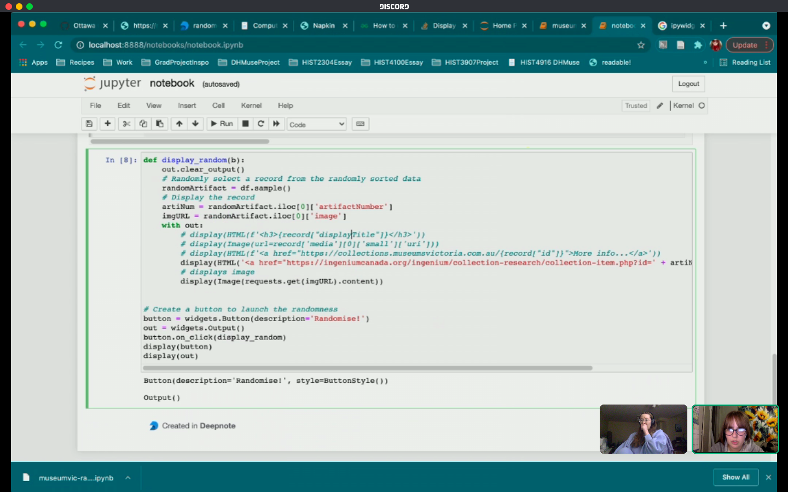

# Notebook Building

## Notebook Objectives
---
### Purpose of Notebook
- Random artifact generator
- Visualize most common categories of technology
- Where artifacts come from

### Why Notebook is Relevant + Predictions About Possible Results of our Work
- What the people like, what they don't like
- See new things/stuff you would not normally look for
- What museum has the most of and what the least of
  - war stuff=glorifying war
-  Higher amount of war items
  - Western things, due to it being a western museum (where things are from)
    - How did we get the non-Western items and transparency

### Sources of Data + Strengths and Weaknesses of Data
- Ingenium Collection
- Interrogation of data --> very useful questions that I'm putting all here for future reference
  - Who collected this data?
    - Ingenium?
  - How and why was this data collected?
    - "to represent the products and processes of all areas of science ad technology" - says on museum page
  - What assumptions are present in this data?
    - assuming they give you all the data you need
      - assumes you know the context of the artifact (limitations of own project, we assume you know the context)
      - WE USE ALL THE INFO WE HAVE
  - What are the consequences of this data in the world?
    - glorification of past technology
      - not thinking critically or asking why did the tech have to change (oil vs solar)?
    - how much info do people need?
      - is what we have enough?
    - data does not answer the question of why we changed technology
      - oil vs solar panels, doesn't say how destructive oil is
  - What does this data reflect about the world?
    - what is deemed important enough to be digitized
      - why are some things not digitized

## Programming
---
- Import data
- Create list from artifact #
  - made a list
  - remove any artifact that does not have an image, because we only want ones that have an image as it is the point of our project
    - what does removing the artifacts that don't have an image tell us?
      - what do we favour?
      - what do we feel we need images of?
      - issue of how old/fragile the artifact is
        - is it even possible to take a picture of it?
    - went from 108463 rows to 67631 rows
      - so much is missing!
  - **TO DO LATER: see what was removed**
- Random function to select random item from list of #s
  - challenge= need all the data from row of artifact number,--> instead of selecting single number, we can just select a row
- Use # to make URL for image --> add check to make sure image exists, if `false` pull new number
  - don't need  `false` because we did the step to get rid of artifacts without images
- Use # to make URL for collections entry
- Pull data from webpage OR csv (whichever is better formatted)
  - what context does it give, and what does it not
  - we are debating ethics/what data to pull from csv
    - what information should we display?
      - 37 columns, do we need all 37 columns?
  - Chantal- essential contextual information
  - Sara agrees, but what does ^ contain
- making the artifact number the URL, so it will be displayed but also so it gives access to the rest of the information
  - questions of interest and will people want to click on certain objects
  - but if we put everything, people might not read all of it
- deepnote does not support ipywidgets
  - sad for us, but a problem with deepnote
    - fresh tech
- cannot get ipywidgets button to display

  - someone had same problem, but we cannot see what they did to solve it :(
  - widget tab not in ours, pip and conda installed widgets tab so hopefully that will help us!!!
    - installing in separate blocks, clear kernal, use magic formula and nothing yet
    - Chantal kept good notes and is checking scraper because this happened before
  - manual installing pandas and widgets in new environment
  - upgrading pip to install pandas and ipywidgets
    - installed pip properly?
- no module called request error
  - where is it installing?
    -in the right place
- WRONG ENVIRONMENT - PYTHON 2 SOMEHOW
- widgets installed - install widgits in kernal

---
#### RANDOM NOTES
- DID MY PRACITUM AT INGENIUM
- chantal would not have thought of user input point where you can find new things for yourself and new interests
- see what museum likes and dislikes
